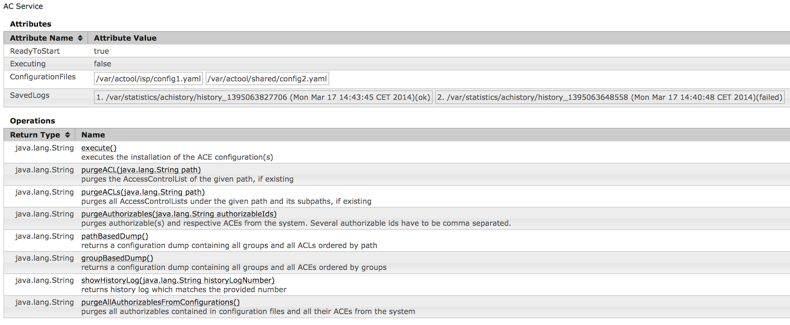
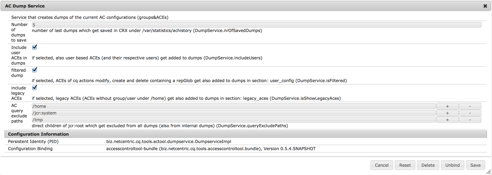
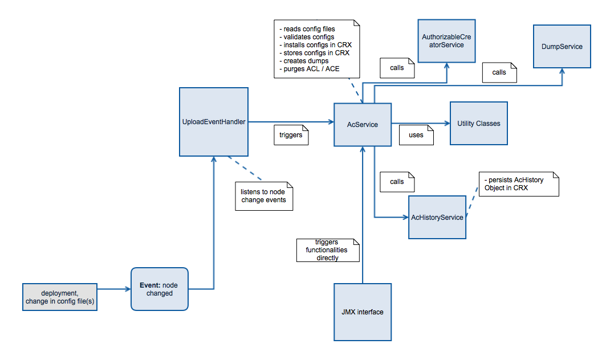

Access Control Tool for Adobe Experience Manager
================================================

The Access Control Tool for Adobe Experience Manager (ACTool) is a tool that simplifies the specification and deployment of complex [Access Control Lists in AEM] (http://docs.adobe.com/docs/en/cq/current/administering/security.html#Access%20Control%20Lists%20and%20how%20they%20are%20evaluated).

# Prerequisites

Building the ACTool requires Java 7 and Maven 3.2.

Installing ACTool requires AEM 6.0.

# Installation

A full build of ACTool can be executed by running:

```
mvn clean install
```

This command, if successful, will create a CQ Package as a ZIP file inside accesscontroltool-package/target called accesscontroltool-package-<VERSION>.zip.

The package can be installed using the AEM Package Manager or directly from the command line, assuming AEM is running on host localhost, port 4502, using the command:

```
mvn -PautoInstallPackage install
```

# Configuration File Format

For better human readability and easy editing the ACL configuration files use the YAML format.

## Overall structure a of an AC configuration file


Every configuration file comprises a group section where groups and their membership to other groups get defined and a ACE section where all ACEs in the repository regarding these groups get defined. These ACE definitions are again written under the respective group id. The group of an ACE definition in each configuration file has to match a group which is also defined in the same file. Groups which are contained in the memberOf property within a group definition have either to be defined in another configuration file or already be installed in the system on which the installation takes place.

## Configuration of groups

A principal record in configuration file starts with the principal id followed by some indented data records which comprise of:

    optional principalname
    comma separated list of other groups which the current principal should belong to
    optional description 


Overall format

```
[Groupd Id]
     - name: groupname (optional, if empty groupd id is taken)
     - isMemberOf: comma separated list of other groups
     - description: (optional, description)
     - path: ?
```

Example

```
isp-editor      
   - isMemberOf: fragment-restrict-for-everyone,fragment-allow-nst
```

If the memberOf property of a group contains a group which is not yet installed in the repository, this group gets created and its rep:members property gets filled accordingly. if another configuration gets installed having a actual definition for that group the data gets merged into the already existing one.

## Configuration of ACEs

The configurations are done per principal followed by indented informations which comprise of config data which represents the settings per ACE. This data includes

property | comment | optional
--- | --- | ---
path | a node path. Wildcards `*` are possible. e.g. assuming we have the language trees de and en then `/content/*./test` would match: `/content/de/test` and `/content/en/test` (mandatory). If an asterisk is contained then the path has to be written inside single quotes (`'...'`) since this symbol is a functional character in YAML. | no
permission | the permission (either `allow` or `deny`) | no
actions | the actions (`read,modify,create,delete,acl_read,acl_edit,replicate`). Reference: <http://docs.adobe.com/docs/en/cq/current/administering/security.html#Actions> | no, either actions or privileges; also a mix of both is possible
privileges | the privileges (`jcr:read, rep:write, jcr:all, crx:replicate, jcr:addChildNodes, jcr:lifecycleManagement, jcr:lockManagement, jcr:modifyAccessControl, jcr:modifyProperties, jcr:namespaceManagement, jcr:nodeTypeDefinitionManagement, jcr:nodeTypeManagement, jcr:readAccessControl, jcr:removeChildNodes, jcr:removeNode, jcr:retentionManagement, jcr:versionManagement, jcr:workspaceManagement, jcr:write, rep:privilegeManagement`). References: <http://jackrabbit.apache.org/oak/docs/security/privilege.html> <http://www.day.com/specs/jcr/2.0/16_Access_Control_Management.html#16.2.3%20Standard%20Privileges> | no
repGlob |a repGlob expression | yes

Every new data entry starts with a "-". 


Overall format

```
[principal]
   - path: a valid node path in CRX
     permission: [allow/deny]
     actions: actions string
     privileges: privileges string (optional)
     repGlob: regex (optional, path restriction as regular expression)
```

Only ACEs for groups which are defined in the same configuration file can be installed! This ensures a consistency between the groups and their ACE definitions per configuration file.

Cq actions and jcr: privileges can be mixed. If jcr: privileges are already covered by cq actions within an ACE definition they get ignored. Also aggregated privileges like jcr:all or rep:write can be used.

Example:

```
fragment-allow:
 
     - path: /content/isp
       permission: allow
       actions: read,modify,create,delete,acl_read,acl_edit,replicate
       repGlob: */jcr:content*
 
     - path: '/content/isp/*/articles'
       permission: allow
       actions: read,write
       privileges:
 
     - path: /content/intranet
       permission: allow
       actions: read,write
       privileges: crx:replicate
 
 fragment-deny:
 
     - path: /
       permission: deny
       actions: modify,create,delete,acl_read,acl_edit,replicate
```

In case the configuration file contains ACEs for groups which are not present in the current configuration no installation takes place and an appropriate error message gets displayed in the history log.

All important steps performed by the service as well as all error/warning messages get written to error log and history.

## Loops

Configuration sections for groups and ACEs allow to use loops to specify multiple, similar entries. In order to do this, a FOR statement has to be used in place of a group name. The FOR statement names a loop variable and lists the values to iterate over. All the children of the FOR element are repeated once per iteration and all group names and property values of child elements that contain the name of the loop variable within '${' and '}' have that expression substituted with the current value of the loop variable.

For example, the following configuration element:

```
- FOR brand IN [ BRAND1, BRAND2, BRAND3 ]:

    - content-${brand}-reader:

       - name: 
         memberOf: 
         path: /home/groups/${brand}
```

Gets replaced with

```
    - content-BRAND1-reader:

       - name: 
         memberOf: 
         path: /home/groups/BRAND1

    - content-BRAND2-reader:

       - name: 
         memberOf: 
         path: /home/groups/BRAND2

    - content-BRAND3-reader:

       - name: 
         memberOf: 
         path: /home/groups/BRAND3
```

### Nested Loops

FOR loops can be nested to any level:

```
- for brand IN [ BRAND1, BRAND2 ]:

    - content-${brand}-reader:

       - name: 
         memberOf: 
         path: /home/groups/${brand}

    - content-${brand}-writer:

       - name: 
         memberOf: 
         path: /home/groups/${brand}
         
    - for mkt in [ MKT1, MKT2 ]:
                       
        - content-${brand}-${mkt}-reader:

           - name: 
             memberOf: 
             path: /home/groups/${brand}/${mkt}

        - content-${brand}-${mkt}-writer:

           - name: 
             memberOf: 
             path: /home/groups/${brand}/${mkt}
```

This will create 12 groups:

* content-BRAND1-reader
* content-BRAND1-writer
* content-BRAND1-MKT1-reader
* content-BRAND1-MKT1-writer
* content-BRAND1-MKT2-reader
* content-BRAND1-MKT2-writer
* content-BRAND2-reader
* content-BRAND2-writer
* content-BRAND2-MKT1-reader
* content-BRAND2-MKT1-writer
* content-BRAND2-MKT2-reader
* content-BRAND2-MKT2-writer

## Validation

First the validation of the different configuration lines is performed based on regular expressions and gets applied while reading the file. Further validation consists of checking paths for existence as well as for double entries, checks for conflicting ACEs (e.g. allow and deny for same actions on same node), checks whether principals are existing under home. If an invalid parameter or aforementioned issue gets detected, the reading gets aborted and an appropriate error message gets append in the installation history and log.

If issues occur during the application of the configurations in CRX the installation has to be aborted and the previous state has to stay untouched! Therefore the session used for the installation only gets saved if no exceptions occured thus persisting the changes.

# Deploying ACLs

## Storage of configurations in CRX

Example showing 3 separate project-specific configuration sub-nodes each containing one or more configuration files:


The projectspecific configuration files get stored in CRX under a node which can be set in the OSGi configuration of the AcService (system/console/configMgr). Each child node contains the project specific configuration file(s). Everytime a new installation gets executed, the newest configuration file gets used. The folder structure gets created by deployment or manually in CRX. Each time a new configuration file gets uploaded in CRX (e.g. deployment) or the content of a file gets changed a node listener can trigger a new installation of the configurations. This behaviour can be enabled/disabled in UploadListenerService OSGi config.

## Installation process

During the installation all groups defined in the groups section of the configuration file get created in the system. In a next step all ACEs configured in the ACE section get installed in CRX. Any old ACEs regarding these groups not contained anymore in the config but in the repository gets automatically purged thus no old or obsolete ACEs stay in the system and any manual change of ACEs regarding these groups get reverted thus ensuring a defined state again. ACEs not belongig to those groups in the configuration files remain untouched. So after the installation took place all groups and the corresponding ACEs exactly as defined in the configuration(s) are installed on the system.

If at any point during the installation an ecxeption occurs, no changes get persisted in the system. This prevents ending up having a undefined state in the repository.

During the installation a history containing the most important events gets ceated and persisted in CRX for later examination.
Merging of  ACEs

To achieve the aforementioned requirements every new installation comprises the following steps:

* The group based ACE configuration from configuration file gets transformed into a node based configuration
* A dump in the same format gets fetched from the repository
* On each node contained in this file the following steps get performed:
    * The ACL from dump and from the configuration gets compared
    * If there are already ACEs in the repository regarding a group from the configuration, these ACEs get removed
    * The other ACEs not contained in the respective ACL from config get merged into the ACL from the config and get ordered (deny ACEs followed by allow ACEs)
    * The ACL from in repo gets replaced by the merged one from config
* In case there is a node in repository dump that is not covered in the config the following step gets performed
    * if the ACL of that node has one or several ACEs belonging to one or several groups from config, these ACEs get deleted
    
## AC Service
    
The main operation purpose of the AC service is the installation of ACE / group definitions from one or several configuration files to a CQ instance on the one hand or the creation of such files (dump) out of an existing configuration on the other hand. It offers possibilities like purging existing ACEs / principals from the instance before installing new ones, merging / adding new ACEs or performing a rollback to a previously saved state if needed. 
 
The configuration for ACEs principals and groups can be maintained in one file or in dedicated files.
 
The configurations are contained in textual files.These files get transferred to CRX usually via deployment. The service can be triggered by a JCR listener which reacts on node changes underneath a configurable path to detect a new configuration in the system, or by triggering the executing it via JMX.
 
Before installing a new configuration on an instance a validation of the data stored in the configuration file takes place. In case an issue gets detected the installation doesn't get performed.


    
## Dump service

The dump Service is responsible for creating dumps which are accessible via JMX whiteboard. There are 2 kinds of dumps supported: path ordered- and principal ordered dumps.

* path ordered dumps: here all ACEs in the dump are grouped by path thus representing a complete ACL. This kind of dump gets triggered by the method: pathBasedDump().
* group based dumps: here all ACEs in the dump are grouped by their respective principal (group or user). This kind of dump gets triggered by the method: groupBasedDump().



Every created dump can be watched directly in JMX and also gets saved in CRX under /var/statistics/achistory/dump_[Timestamp]. The number of dumps to be saved in CRX can be configured in the OSGi configuration of the dump service in the field: "Number of dumps to save" (see Screenshot)

There are also 3 additional options available in the OSGi configuration of the dump service:

* Include user in ACEs in dumps: if checked, all users which have ACEs directly set in the repository get added to the dump (ACEs in section "- ace_config:" and users in section "- user_config:")
* filtered dump: if checked, all ACEs belonging to the cq actions: modifiy, create or delete which have a repGlob set don't get added to the dump. Per default they are omitted since they're automatically set within CQ if one of the action gets set and are not necessary to expicitly being set in a new configuration file.
* include legacy ACEs in dump: if checked, legacy ACEs (ACEs of groups/users which can not be found under /home) also get added to the dump in an extra section called "legacy_aces" at the end of the dump. The order of ACEs listed there is the same as it is for the "valid" ACEs (path based or group based). If needed these ACEs can be manually deleted using the "purge_Authorizables" function by entering the respective principal name(s).

Internal dumps which get created and used everytime an new AC installation takes place get also created by this service and contain always all ACEs (users and unfilteredACEs).

## AC (search) Query

In order to exclude certain direct child nodes of the jcr:root node from the query (e.g. /home, since we don't want to have the rep: policy nodes of each user) to get all the rep: policy nodes in the system, these nodes can be configured. This configuration takes place in the OSGi configuration of the AcService ('/home', '/jcr:system' and '/tmp' are exclude by default). When a query is performed (e.g. during a new installation) , the results of the single queries performed on the nodes which are not excluded get assembled and returned as collective result for further processing.

## UploadListenerService

The Upload Listener Service allows to configure the NodeEvent Listener. In the OSGi console it can be enabled/disabled furthermore the listener path can also be configured here.

If enabled each new upload of a projectspecific configuration file triggers the AceService. Before a new installation starts, a dump (groups & ACLs) gets created which get stored under the backups-node.

## JMX interface

The JMX interface offers the possibility to trigger the functions offered by the ACE service. These are:

* starting a new installation of the newest configuration files in CRX.
* purging of ACLs (of a single node or recursively for all subnodes)
* deletion of single ACEs
* purging users/groups from the instance (including all related ACEs).
* creation of dumps (ordered by path or by group)
* showing of history logs created during the installation

Also important status messages are shown here:

* readiness for installation (if at least one configuration file is stored in CRX)
* success status of the last installation
* display of the newest installation files (incl. date information)
* display of the paths of last 5 history logs saved in CTX and a success status of each of those installation

## History Service

A history object collects messages, warnings, and also an exception in case something goes wrong. This history gets saved in CRX nder /var/statistics/achistory. The number of histories to be saved can be configured in the history service.

## Purge ACLs/Authorizables

Beside the options to install access control configurations and to create dumps the ac tool also offers different possibilities to purge ACLs/authorizables from the system. These methods are also available via JMX whiteboard (see screenshot: JMX Whiteboard of the AC tool).

Method | Action
--- | ---
purgeACL | This method purges the access control list of a (single) node in repository. The node path is entered as parameter before invocation.
purgeACLs | This method purges the access control list a node and also the access control lists of all child nodes. The node path is entered as parameter before invocation.
purgeAuthorizables | This method purges authorizables from home and also deletes all corresponding ACEs from the repository. Several authorizables are entered as comma separated list before invocation.
purgeAllAuthorizablesFromConfigurations | This method purges all authorizables defined in all configurations files and all their corresponding ACEs from the repository.

For any of these purge actions a separate purge history (node) containing all logging statements gets persisted in CRX in order to be able to track every of those actions afterwards. Such a purge history node gets saved under the history node of the current ac installation in place. Any of these purge nodes has a timestamp as suffix in the node name.

## Curl calls

### Trigger the 'execute' method of the AC service

```
curl -sS --retry 1 -u ${CQ_ADMINUSER}:${CQ_ADMINPW} -X POST "http://${CQ_SERVER}:${CQ_PORT}/system/console/jmx/biz.netcentric.cq.tools.actool:id='ac+installation'/op/execute/"
```

# Architectural Overview


