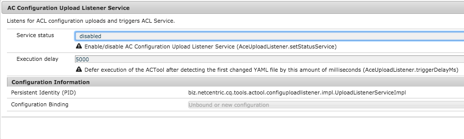
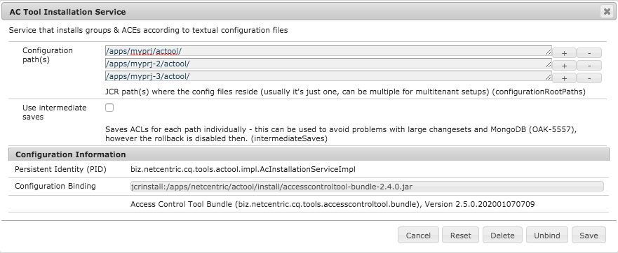

# Applying ACLs

The following steps are performed:

1. All AC entries are removed from the repository which refer to an authorizable (user/group) being mentioned in the YAML configuration file (no matter to which path those entries refer).
1. All authorizables being mentioned in the YAML configuration get created (if necessary, i.e. if they do no exist yet).
1. All AC entries generated from the YAML configuration get persisted in the repository. If there are already existing entries for one path (and referring to another authorizable) those are not touched. New AC entries are added at the end of the list. All new AC entries are sorted, so that the Deny entries are listed above the Allow entries. Since the AC entry nodes are evaluated bottom-to-top this sorting order leads to less restrictions (E.g. a user might be member of two groups where one group sets a Deny and the other one sets an Allow. This order ensures that the Allow has a higher priority.).

If at any point during the installation an exception occurs, no changes get persisted in the system. This prevents ending up having a undefined state in the repository.

During the installation a history containing the most important events gets created and persisted in CRX for later examination.
The following section explain how you can trigger the installation of ACLs.

    
## Installation Hook

You can automatically install ACEs and authorizables defined in YAML files within a package using the Content Package Install Hook mechanism.
If you use the content-package-maven-plugin (before the 1.02 release) enable the installation hook via: 

```
<plugin>
  <groupId>com.day.jcr.vault</groupId>
  <artifactId>content-package-maven-plugin</artifactId>
  <configuration>
    <properties>
      <installhook.actool.class>biz.netcentric.cq.tools.actool.installhook.AcToolInstallHook</installhook.actool.class>
    </properties>
  </configuration>
</plugin>
```

If you use version 1.02 or later of the content-package-maven-plugin then the installation hook will have to be configured using the jackrabbit filevault-package-maven-plugin:

```
<plugin>
    <groupId>org.apache.jackrabbit</groupId>
    <artifactId>filevault-package-maven-plugin</artifactId>
    <configuration>
        <properties>
            <installhook.actool.class>biz.netcentric.cq.tools.actool.installhook.AcToolInstallHook</installhook.actool.class>
        </properties>
    </configuration>
</plugin>
```

The `*.yaml` files are installed directly from the package content and respect the [run mode semantics](Configuration.md). Otherwise there is no limitation, so the YAML files will be picked up from anywhere in the package (as long as the parent node does not contain a `.` followed by one or multiple not matching run modes).

Although it is not necessary that the YAML files are covered by the filter rules of the `filter.xml`, this is recommended practice. That way you can see afterwards in the repository which YAML files have been processed. However if you would not let the `filter.xml` cover your YAML files, those files would still be processed by the installation hook.

## JMX

See [JMX apply() method](Jmx.md).

Different options on you can access JMX are listed [here](https://helpx.adobe.com/experience-manager/kb/workflow-monitor-via-jmx.html).

### Curl calls

Trigger the 'apply' method of the AC JMX service through HTTP Post

```
curl -sS --retry 1 -u ${CQ_ADMINUSER}:${CQ_ADMINPW} -X POST "http://${CQ_SERVER}:${CQ_PORT}/system/console/jmx/biz.netcentric.cq.tools:type=ACTool/op/apply/"
```
    
## Upload Listener Service

The Upload Listener Service allows to configure the NodeEvent Listener.

If enabled each new upload of a project specific configuration file triggers the installation. Before a new installation starts, a dump (groups & ACLs) gets created and stored under the backups-node.

It can be enabled/disabled in the OSGi console (AC Configuration Upload Listener Service). The listener path is configured in AC Installation Service.






