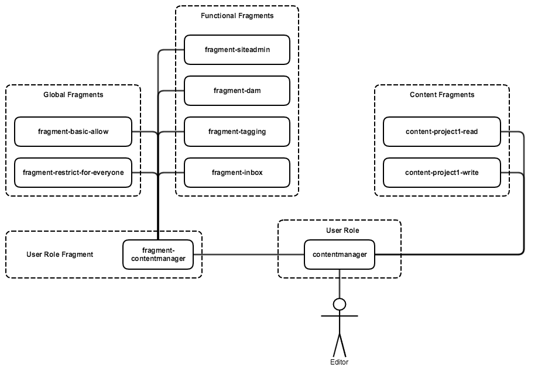

# Best Practices

## Split files by project

In case you have multiple projects/teams you should split the config files for them in case groups and ACLs are independent. E.g. both project's content packages can ship with their own files containing only their groups. This makes it easier to update the rights later.

In case groups are shared between projects you should create a common package.

## Split files by topic

Create multiple folders for e.g. service users, generic role definitions and actual roles that are assigned to users. This will help you to find the place where to make changes.

## Use one package for all environments

There is no need to setup multiple content packages to install the ACTool config files in multiple environments. You can use run modes in case there are differences between environments.

## Create demo users with test content

Since you can also create users it makes perfect sense to add some demo users in your test content package. This way you always have a set of defined users with group permissions installed. Of course, test content must not be installed on production to have no security problem.

## Always assign permissions to groups, never to single users

You have many more users than groups so groups simplify the structure. Groups help provide an overview over all accounts. Inheritance is simpler with groups. Users come and go while groups are existing long-term.

## Always use Allow statements. Avoid using a Deny statement (whenever possible)

If a user is a member of more than one group, the deny statements from one group may cancel the allow statement from another group, or vice versa. This can cause unexpected effects. Use a model which introduces basic allow/deny fragments in combination with functional/content fragments.

## Always test your access rights configuration on a test system 

Before applying a configuration to production it should have been thoroughly tested on a dedicated test instance. In general there should always be a test instance available on which a full production copy of the access configuration is available/testable. Keep the access control configuration of production and test systems in sync.

## Consider access rights when designing you content structure

Make access rights one of the main drivers of your information architecture.

## Keep it simple

Try to keep the number of groups as small as possible by detecting similarities and using fragments. Try to achieve a clear hierarchy of groups/fragments.

## Avoid globbing

Since globbing expressions get implicitly applied to child nodes they are not directly visible in content. Avoid them if possible.

## Remember that ACL evaluation slows down the system responsiveness

The longer the list of ACEs get the longer the permission evaluation takes place. Therefore, try to keep the list short.

## White listing nodes

There are cases where you want to deny access to a node's children by default and only allow access to specific children. This requirement is quite common for /content.
You can achieve this by using globbing. In the example below /content is denied for all users in fragment-restrict-for-everyone. But this will not only deny access to the child nodes but also to /content itself. So we need two more rules:

* allow to /content with repGlob "": This will allow access to the /content node itself ("" as repGlob means just this node)
* allow to /content with repGlob "jcr:*": This is needed e.g. for site admin since it needs to read the jcr:primaryType property.

This will allow to see /content without its children.

In a second group (fragment-project1) you can then allow to read the child node /content/project1.


```
    - fragment-restrict-for-everyone:

       - path: /content
         permission: deny
         actions: 
         privileges: jcr:read,jcr:readAccessControl
         repGlob: 

       - path: /content
         permission: allow
         actions: 
         privileges: jcr:read,jcr:readAccessControl
         repGlob: ""

       - path: /content
         permission: allow
         actions: 
         privileges: jcr:read,jcr:readAccessControl
         repGlob: /jcr:*

    - fragment-project1:

       - path: /content/project1
         permission: allow
         actions: 
         privileges: jcr:read,jcr:readAccessControl
         repGlob: 

```

## Use fragment groups for functional aspects and content access

You should separate rights for functional aspects (e.g. access to DAM editor, CRX/DE or tag management) and content.
This means there are groups just for tool access (we call them fragment-... here) and others just for content (we call them content-.. here). This way you can enable access to required tools easily and editors only see what they need on the welcome page.

The group that is effectively assigned to a user then includes a functional group for tooling access and content groups.



In this case the user is a content manager. So the group "contentmanager" provides him the content groups + the functional group "fragment-contentmanager" to enable the right tools. The group "fragment-contentmanagers" includes functional aspects such as "fragment-dam" for access to DAM tool. It also includes the groups "fragment-restrict-for-everyone" and "fragment-basic-allow".

* fragment-restrict-for-everyone: initially denies access to all tools and content, includes all deny rules
* fragment-basic-allow: allows access to nodes that are readable for all users (e.g. /content without subnodes)

Please note that the functional fragment groups do not provide any content access. Read/write access to a website is provided by the groups "content-project1-read" and "content-project1-write".
