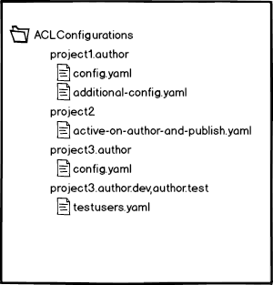
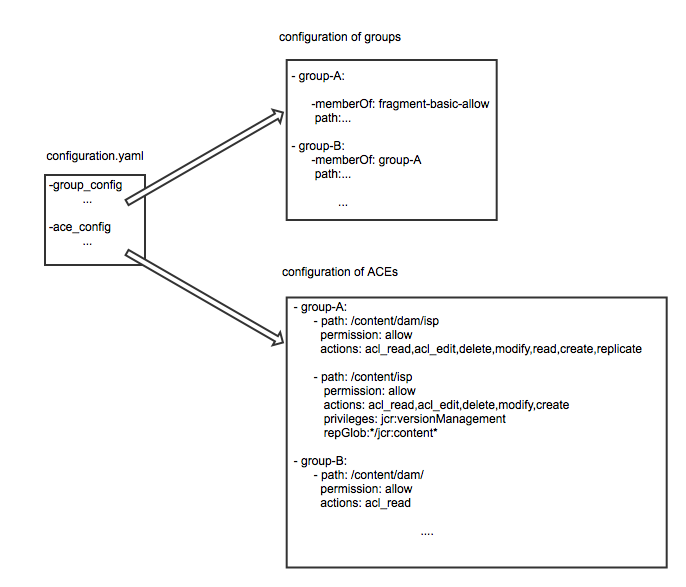

# Configuration File Format

For better human readability and easy editing the ACL configuration files use the YAML format.

You can split your configuration to multiple files and directories. See also [best practices](BestPractices.md). Each folder can include one or more Yaml files ("*.yaml").
The file format is the same for all files.

You can find some examples in [example config package](../accesscontroltool-exampleconfig-package/src/main/jcr_root/apps/netcentric/actool-exampleconfig).


## Storage of configurations in CRX

This example shows three separate project specific configuration subnodes (multipleFiles, runmodes, simple) each containing one or more configuration files:



The project specific configuration files are stored in CRX under a node which can be set in the OSGi configuration of the AcService (system/console/configMgr). Each folder underneath this location may contain `*.yaml` files that contain AC configuration. You can use a normal content package to deploy the files.

## Run modes 

In general the parent node may specify required Sling run modes being separated by a dot (```.```). Folder names can contain runmodes in the same way as OSGi configurations ([installation of OSGi bundles through JCR packages in Sling](http://sling.apache.org/documentation/bundles/jcr-installer-provider.html)) using a `.` (e.g. `myproject.author` will only become active on author). Additionally, multiple runmodes combinations can be given separated by comma to avoid duplication of configuration (e.g. `myproject.author.test,author.dev` will be active on authors of dev and test environment only).

Examples:

* project.author: runs on "author" run mode only
* project.author.dev: runs only when run modes "author" and "dev" are present
* project.author.test,author.dev: requires run mode "author" and either "test" or "dev" to be present

## Overall structure a of an AC configuration file



Every configuration file comprises a group section where groups and their membership to other groups get defined and a ACE section where all ACEs in the repository regarding these groups get defined. The principal name of an ACE definition in each configuration file has to match a group id which is also defined in the same file. Groups which are contained in the `isMemberOf` property within a group definition have either to be defined in another configuration file or already be installed in the system on which the installation takes place.

## Configuration of groups

Groups are specified in the **group_config**. A group record in the configuration file starts with the group id followed by some indented data records containing properties like name/description and group membership. The groups created through the AC Tool always have a principal name equal to the given group id:

property | comment | required
--- | --- | ---
name | Name of the group as shown in UI | optional, if empty group id is taken
description | Description of the group | optional
externalId | Required for AC setups since AEM 6.2 SP1 that synchronize groups from LDAP to AEM. The value has to be in format LDAP-DN;IDP-NAME where LDAP-DN is the full distinguished name and IDP-NAME is configured in OSGI config PID org.apache.jackrabbit.oak.security.authentication.ldap.impl.LdapIdentityProvider property "provider-name". Example: `externalId: "cn=group-name,ou=mydepart,ou=Groups,dc=comp,dc=com;IDPNAME"`. Since v1.9.3 | optional
path | Path of the group either relative or absolute | optional
isMemberOf | comma separated list of groups this groups is a member of | optional
members | comma separated list of groups that are member of this group (allows to specify the relationshipo from the other side, however prefer `isMemberOf` over members if possible) | optional
migrateFrom | a group name assigned member users are taken over from, since v1.7 | optional

Example:

```
- group_config:

  - myeditors:
    - isMemberOf: mystaff
      members: editor

  - system-read:
    - isMemberOf: 
      description: system users with read access
      path: fragments/system # if relative, /home/groups is automatically prefixed
      members: system-reader
```

### Group migration

The property 'migrateFrom' allows to migrate a group name without loosing their members. Members of the group given in migrateFrom are taken over and the source/old group is deleted afterwards. This property is only to be used temporarily. Usually, it is only included in one released version that travels all environments. Once all groups are migrated the migrateFrom property should be removed. If the property points to a group that does not exist (anymore) the property is ignored.

## Configuration of users

In general it is best practice to not generate regular users by the AC Tool but use other mechanism (e.g. LDAP) to create users. However, it can be useful to create system users (e.g. for replication agents or OSGi service authentiation) or test users on staging environments.

Users can be configured in the same way as groups in the **user_config** section. A user record in the configuration file starts with the user id followed by some indented data records containing properties. The users created through the AC Tool always have a principal name equal to the given user id:

property | comment | required
--- | --- | ---
name, description, path, isMemberOf | Work exactly as for groups | optional
password | The PW for the user. Obviously this is stored in plain text and should only be used for test users | Required for non-system users, otherwise must not be set
isSystemUser | Create users as system user (AEM 6.1 and later) | optional
profileContent | Allows to provide [enhanced docview xml](https://jackrabbit.apache.org/filevault/apidocs/org/apache/jackrabbit/vault/util/DocViewProperty.html) that will reset the profile to the given structure after each run (since v1.8.2, enhanced docview since v1.9.1) | optional
preferencesContent | Allows to provide [enhanced docview xml](https://jackrabbit.apache.org/filevault/apidocs/org/apache/jackrabbit/vault/util/DocViewProperty.html) that will reset the preferences node to the given structure after each run (since v1.8.2, enhanced docview since v1.9.1) | optional

Example:

```
- user_config:

  - editor:
    - isMemberOf: myeditors
      password: secret
      
  - poweruser:
    - name: "Power User"
      isMemberOf: powerusers
      password: secret
      path: myprojusers
      profileContent: <jcr:root jcr:primaryType="nt:unstructured" email="poweruser@example.com"/>

  - system-reader:
    - name: system-reader
      isMemberOf: system-read
      path: system
      isSystemUser: true
```

Group memberships can be set on user entry or group entry or both.


## Configuration of ACEs

The configurations are done per principal (given through its name) followed by indented settings for each ACE. Currently only principal names are supported which are equal to one of the created group ids.

This data includes

property | comment | required
--- | --- | ---
path | A node path. Wildcards `*` are possible. e.g. assuming we have the language trees de and en then `/content/*/test` would match: `/content/de/test` and `/content/en/test` (mandatory). If an asterisk is contained then the path has to be written inside single quotes (`'...'`) since this symbol is a functional character in YAML. If path is not supplied the entry is used as repository level permission. | no
permission | the permission (either `allow` or `deny`) | yes
actions | the actions (`read,modify,create,delete,acl_read,acl_edit,replicate`). Reference: [Actions](http://docs.adobe.com/docs/en/cq/current/administering/security.html#Actions) | either actions or privileges need to be present; also a mix of both is possible
privileges | the privileges (`jcr:read, rep:write, jcr:all, crx:replicate, jcr:addChildNodes, jcr:lifecycleManagement, jcr:lockManagement, jcr:modifyAccessControl, jcr:modifyProperties, jcr:namespaceManagement, jcr:nodeTypeDefinitionManagement, jcr:nodeTypeManagement, jcr:readAccessControl, jcr:removeChildNodes, jcr:removeNode, jcr:retentionManagement, jcr:versionManagement, jcr:workspaceManagement, jcr:write, rep:privilegeManagement`). References: [Oak Privileges](http://jackrabbit.apache.org/oak/docs/security/privilege.html) [JCR Privileges](http://www.day.com/specs/jcr/2.0/16_Access_Control_Management.html#16.2.3%20Standard%20Privileges) | either actions or privileges need to be present; also a mix of both is possible
repGlob |A [repGlob expression](https://jackrabbit.apache.org/api/2.8/org/apache/jackrabbit/core/security/authorization/GlobPattern.html) like "/jcr:*". Please note that repGlobs do not play well together with actions. Use privileges instead (e.g. "jcr:read" instead of read action). See [issue #48](https://github.com/Netcentric/accesscontroltool/issues/48). If the globbing expression starts with an asterisk, it has to be put between quotes. Using `repGlob` is a shortcut for `rep:glob` in sub element `restrictions` | no
restrictions|An associative array of restriction entries. Each entry uses the restriction name as key (e.g. `rep:glob`) and a literal as value. Values for multi-valued restrictions (like e.g. `rep:ntNames`) are also given as YAML string literals with commas separating each value (not using YAML arrays, in line with how isMemberOf is configured). Arbitrary restrictions are supported as long as they are supported by the underlying repository on which the installation takes place (validated before installation starts). For an overview of supported restrictions in different Oak versions see: [Oak Restriction Management](http://jackrabbit.apache.org/oak/docs/security/authorization/restriction.html). Available from version 1.9.0.| no
initialContent | Allows to specify [enhanced docview xml](https://jackrabbit.apache.org/filevault/apidocs/org/apache/jackrabbit/vault/util/DocViewProperty.html) to create the path if it does not exist. The namespaces for jcr, sling and cq are added automatically if not provided to keep xml short. Initial content must only be specified exactly once per path (this is validated). If paths without permissions should be created, it is possible to provide only a path/initialContent tuple. (since version v1.7.0, enhanced docview since v1.9.1) | no
keepOrder | Defaults to false - use carefully only for special use cases as described in [Use Manual ACL Ordering](AdvancedFeatures.md#use-manual-acl-ordering-since-191) (since v1.9.1) | no

Every new data entry starts with a "-".
The rules are sorted so that deny rules are always on top of allow rules. ACEs that are not part of the config file will not be reordered and stay on very top. This way allow rules are evaluated first, then deny rules and finally any system rules. 


Overall format

```
- [principal]
   - path: a valid node path in CRX
     permission: [allow/deny]
     actions: actions (optional, comma separated)
     privileges: privileges (optional, comma separated)  
     repGlob: GlobPattern (optional, path restriction as globbing pattern, shortcut for using rep:glob in restrictions)
     restrictions: Associative Array (optional, see below)
```

Entry with restrictions

```
- [principal]
   - path: a valid node path in CRX
     permission: [allow/deny]
     actions: actions (comma separated)
     privileges: privileges (comma separated)  
     restrictions: 
        rep:ntNames: nt:folder # rep:ntNames supports multiple values, but it's fine to supply only one value
        rep:itemNames: nodeName1,nodeName2,nodeName3 # multivalued
        rep:glob: GlobPattern # only one value may be supplied for this single-valued restriction
        # any supported restriction can be listed here
        # please note that if multiple restrictions are given, they are combined with "AND" (usually, only one is used per path entry)
```

Only ACEs for groups which are defined in the same configuration file can be installed. This ensures a consistency between the groups and their ACE definitions per configuration file.

Cq actions and jcr: privileges can be mixed. If jcr: privileges are already covered by cq actions within an ACE definition they get ignored. Also aggregated privileges like jcr:all or rep:write can be used.

Example:

```
- ace_config:

  - fragment-allow:

    - path: /content/myproject
      permission: allow
      actions: read,modify,create,delete,acl_read,acl_edit,replicate
      repGlob: */jcr:content*

    - path: '/content/myproject/*/articles'
      permission: allow
      actions: read,write
      privileges:
 
    - path: /content/mydemoproject
      permission: allow
      actions: read,write
      privileges: crx:replicate

  - fragment-deny:

    - path: /
      permission: deny
      actions: modify,create,delete,acl_read,acl_edit,replicate
```

In case the configuration file contains ACEs for groups which are not present in the current configuration no installation takes place and an appropriate error message gets displayed in the history log.

All important steps performed by the service as well as all error/warning messages get written to error log and history.

## Global Configuration 

Certain configuration aspects are global and can be configured on top level (since v1.8.5).

```
- global_config:
      minRequiredVersion: 1.8.5
      keepExistingMembershipsForGroupNamesRegEx: external.*

```

Property | Description
--- | ---
minRequiredVersion | This configuration requires at least the given version of ACL tool. If an older version is found the configuration file is not processed.
keepExistingMembershipsForGroupNamesRegEx | By default group relationships reset to exactly what is specified in configuration. There are cases where you have relationships between groups managed outside of AC tool (e.g. managed by a workflow). Using this option you can assign your external group to a group that is defined in AC Tool configuration. E.g. your AC Tool group "admin" could be member of "external-myworkflow". This setting is a regular expression.

## Validation

First the validation of the different configuration lines is performed and gets applied while reading the file. Further validation consists of checking paths for existence as well as for double entries, checks for conflicting ACEs (e.g. allow and deny for same actions on same node), checks whether principals are existing under /home. If an issue is detected the reading is aborted and an appropriate error message is appended to the installation history and log.

If issues occur during the application of the configurations in CRX the installation has to be aborted and the previous state has to stay untouched. Therefore the session used for the installation only gets saved if no issues occurred thus persisting the changes.

