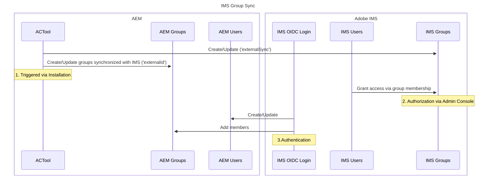

# External Group Sync (with IMS)

Since AC Tool 3.1.0 there is support for creating/updating groups in [Adobe IMS](https://www.adobe.com/content/dam/cc/en/trust-center/ungated/whitepapers/corporate/adobe-identity-management-services-security-overview.pdf). Those are the groups which are exposed in the Adobe Admin Console and automatically used for [AEMaaCS](https://experienceleague.adobe.com/en/docs/experience-manager-cloud-service/content/security/ims-support) and also [AEM 6.5 hosted by AMS](https://experienceleague.adobe.com/en/docs/experience-manager-learn/foundation/authentication/adobe-ims-authentication-technical-video-understand).

## Architecture

Here is the different actors involved in IMS Group sync

## Configuration

To enable that feature, just set the property `externalSync` on the group to be synced in the YAML file to `true`. In order to assign ACLs to those groups make sure that `externalId` is set correctly (otherwise the group on AEM side will not be used for IMS users).
In addition an OSGi configuration for the leveraged [UMAPI](https://adobe-apiplatform.github.io/umapi-documentation/en/) needs to be provided in the configuration PID `biz.netcentric.cq.tools.actool.ims.IMSUserManagement`. This configuration should only be provided for run mode `author` to prevent the same groups from being created/updated multiple times. Also make sure you don't trigger the update too often due to [throttling of that API](https://adobe-apiplatform.github.io/umapi-documentation/en/API_introduction.html#throttling-and-error-handling).

## What is synchronized?

Only the 
- group id (called name in IMS context), 
- the description
- the admins (set via OSGi configuration)
- and product profiles (set via OSGi configuration)

are set for synchronized groups in IMS. Memberships are not modified and external groups are never deleted. However you can update admin users of the managed groups (this involves both adding and removing users) with the additional flag `Also update existing external groups`. This is only available for manually triggered installations from the Web Console Plugin or the Touch UI Web UI. There is right now [no way to remove product profiles](https://github.com/Netcentric/accesscontroltool/issues/800) on already existing groups.
